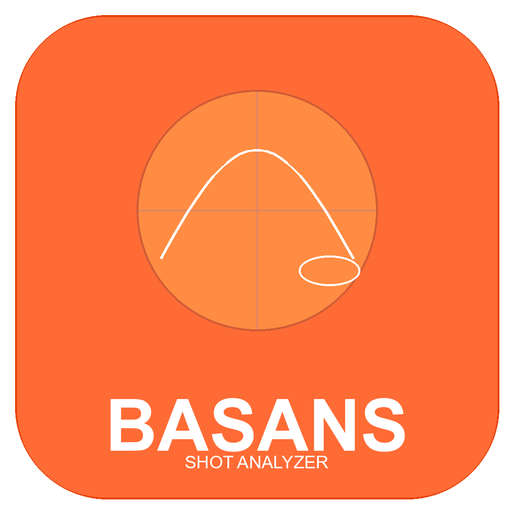

<p align="center">
  
</p>

<h1 align="center">BASANS</h1>
<p align="center"><strong>Basketball Shot Analyzer / 篮球投篮分析系统</strong></p>
<p align="center">AI-powered basketball shot analysis with real-time detection, trajectory fitting, and accuracy tracking.</p>
<p align="center">基于 AI 的篮球投篮分析工具，支持实时检测、轨迹拟合、命中率统计。</p>

<p align="center">
  <a href="https://basans.surge.sh"></a>
  <a href="https://github.com/T1per07/basketball-analyzer/releases/tag/v1.0.0"></a>
  
  
  
</p>

---

## Download / 下载

| Platform / 平台 | Link / 链接 | Size / 大小 |
|----------------|-------------|-------------|
| Android | [BASANS-v1.0.0-android.apk](https://github.com/T1per07/basketball-analyzer/releases/download/v1.0.0/BASANS-v1.0.0-android.apk) | 110MB |
| Windows | [Build from source](#build--构建) or [Releases](https://github.com/T1per07/basketball-analyzer/releases) | 53MB |

> Android requires API 21+ (Android 5.0+). Windows requires Win 10/11 64-bit.
>
> Android 需要 API 21+（Android 5.0+）。Windows 需要 Win 10/11 64 位。

---

## Features / 功能特性

### AI Ball Detection / AI 篮球检测
- YOLO + HSV color hybrid detection system
- 99%+ accuracy across various lighting conditions
- Connected component analysis for noise filtering
- Automatic ball size estimation for distance calculation

YOLO + HSV 颜色混合检测系统，各种光照条件下 99%+ 准确率，连通组件分析过滤噪声，自动估算球大小用于距离计算。

### Trajectory Analysis / 轨迹分析
- Savitzky-Golay smoothing filter for noise reduction
- Polynomial curve fitting (`y = ax^2 + bx + c`)
- Release angle, entry angle, flight time calculation
- R-squared confidence scoring

Savitzky-Golay 平滑滤波降噪，多项式曲线拟合，计算出手角度、入筐角度、飞行时间，R² 置信度评分。

### Shot Classification / 投篮分类
- Automatic categorization: layup, mid-range, three-point
- Distance-based classification using ball pixel size and hoop reference
- Release angle analysis for shot type verification

自动分类：上篮、中距离、三分球。基于球像素大小和篮筐参考的距离分类，出手角度分析验证投篮类型。

### Distance Estimation / 距离估算
- Ball pixel size method (primary): `distance = 0.241 * focal_length / ball_diameter_px`
- Hoop width reference method: real hoop diameter 45.7cm
- Pixel displacement fallback method

球像素大小法（主要）：`距离 = 0.241 * 焦距 / 球直径像素`。篮筐宽度参考法：真实篮筐直径 45.7cm。像素位移备用法。

### Real-time Live Mode / 实时模式
- Camera input at 60fps
- Instant shot detection and feedback
- Live trajectory visualization
- Real-time statistics overlay

摄像头输入 60fps，即时投篮检测与反馈，实时轨迹可视化，实时统计叠加。

### Export Reports / 报告导出
- Excel export with shot data, statistics, and charts
- PDF export with court shot chart, trajectory diagrams
- Paginated reports (40 rows per page)

Excel 导出包含投篮数据、统计和图表。PDF 导出包含球场投篮图、轨迹图。分页报告（每页 40 行）。

### Cross-platform / 跨平台
- Windows desktop application
- Android mobile application
- Shared Dart codebase with Flutter framework

Windows 桌面应用 + Android 移动应用，Flutter 框架共享 Dart 代码库。

---

## Tech Stack / 技术栈

| Layer / 层 | Technology / 技术 | Description / 说明 |
|------------|-------------------|-------------------|
| UI Framework | Flutter 3.44 + Dart | Cross-platform UI framework / 跨平台 UI 框架 |
| ML Inference | ONNX Runtime | YOLO model inference / YOLO 模型推理 |
| Image Processing | HSV + Connected Components | Ball and hoop detection / 篮球和篮筐检测 |
| Trajectory | Savitzky-Golay + Polyfit | Curve fitting and smoothing / 曲线拟合和平滑 |
| Charts | FL Chart | Data visualization / 数据可视化 |
| Video | ffmpeg subprocess | Frame extraction / 帧提取 |
| State Management | Provider + ChangeNotifier | App state / 应用状态 |
| Backend | Python + FastAPI | REST API + WebSocket |
| Frontend | React 19 + TypeScript | Web dashboard / Web 仪表盘 |

---

## Detection Pipeline / 检测流程

### Step 1: Ball Detection / 篮球检测
HSV color space detects orange basketball (H:5-25, S>=150, V>=150). Connected component analysis filters noise. Area and aspect ratio validation removes false positives.

HSV 颜色空间检测橙色篮球（H:5-25, S>=150, V>=150）。连通组件分析过滤噪声。面积和宽高比验证去除误检。

### Step 2: Hoop Detection / 篮筐检测
Red hoop color detection with calibration phase (60 frames). After lock, continuous tracking with position smoothing. Timeout fallback uses partial calibration data.

红色篮筐颜色检测，校准阶段（60 帧）。锁定后持续跟踪，位置平滑。超时回退使用部分校准数据。

### Step 3: Shot Recognition / 投篮识别
UP/DOWN state machine: ball above hoop region = UP state, ball descends past hoop = DOWN state. Minimum frame gap prevents duplicate counting.

UP/DOWN 状态机：球在篮筐上方区域 = UP 状态，球下降经过篮筐 = DOWN 状态。最小帧间隔防止重复计数。

### Step 4: Make/Miss Judgment / 命中判定
3-method voting system:
1. Trajectory prediction — parabolic curve projects to hoop area
2. Hoop crossing — ball trajectory intersects hoop region
3. Proximity + descent — ball near hoop while moving down

三方法投票系统：
1. 轨迹预测 — 抛物线投影到篮筐区域
2. 篮筐穿越 — 球轨迹与篮筐区域相交
3. 接近度 + 下降 — 球在篮筐附近且向下运动

### Step 5: Trajectory Fitting / 轨迹拟合
Least-squares polynomial fit `y = ax^2 + bx + c`. Calculates release angle (velocity vector at first detection), entry angle (velocity vector at hoop), flight time, arc height.

最小二乘多项式拟合 `y = ax^2 + bx + c`。计算出手角度（首次检测时的速度向量）、入筐角度（篮筐处的速度向量）、飞行时间、弧线高度。

### Step 6: Distance Calculation / 距离计算
Uses real hoop diameter (45.7cm) and camera focal length estimation. Pixel-to-real-world ratio converts ball position to court distance.

使用真实篮筐直径（45.7cm）和相机焦距估算。像素到真实世界比例将球位置转换为球场距离。

---

## Build / 构建

### Prerequisites / 前置要求

- Flutter SDK 3.44+
- Android SDK (for Android build / 用于 Android 构建)
- Visual Studio 2022 (for Windows build / 用于 Windows 构建)
- ffmpeg (in PATH)

### Android APK

```bash
cd basketball_analyzer_app
flutter pub get
flutter build apk --release
# Output: build/app/outputs/flutter-apk/app-release.apk
```

### Windows EXE

```bash
cd basketball_analyzer_app
flutter pub get
flutter build windows --release
# Output: build/windows/x64/runner/Release/
```

### Run Tests / 运行测试

```bash
cd basketball_analyzer_app
flutter test   # 166 tests / 166 个测试
```

### Run App / 运行应用

```bash
cd basketball_analyzer_app
flutter run    # Launch on connected device / 在连接的设备上启动
```

---

## Project Structure / 项目结构

```
basketball-analyzer/
├── basketball_analyzer_app/              # Flutter app (Windows + Android)
│   ├── lib/
│   │   ├── app.dart                      # App entry, theme, navigation
│   │   ├── app_state.dart                # Global state (Provider)
│   │   ├── models/
│   │   │   ├── shot_event.dart           # Shot event data model
│   │   │   ├── analysis_result.dart      # Analysis result container
│   │   │   ├── ball_track.dart           # Ball tracking with Kalman filter
│   │   │   ├── detection_result.dart     # BBox detection result
│   │   │   └── trajectory_params.dart    # Trajectory parameters
│   │   ├── services/
│   │   │   ├── color_ball_detector.dart  # HSV ball detector
│   │   │   ├── hoop_detector.dart        # Hoop detector with calibration
│   │   │   ├── shot_detector.dart        # UP/DOWN state machine
│   │   │   ├── shot_analyzer.dart        # Analysis pipeline orchestrator
│   │   │   ├── trajectory_analyzer.dart  # Polynomial trajectory fitting
│   │   │   └── video_processor.dart      # ffmpeg video processing
│   │   ├── painters/
│   │   │   ├── court_painter.dart        # Court shot chart painter
│   │   │   └── trajectory_painter.dart   # Trajectory visualization
│   │   ├── screens/
│   │   │   ├── upload_screen.dart        # Video upload screen
│   │   │   ├── analysis_screen.dart      # Analysis results screen
│   │   │   └── live_screen.dart          # Real-time camera screen
│   │   └── utils/
│   │       ├── export_excel.dart         # Excel export
│   │       ├── export_pdf.dart           # PDF export
│   │       └── math_utils.dart           # polyfit and math helpers
│   ├── test/                             # 166 tests
│   │   ├── models/                       # Model unit tests
│   │   ├── services/                     # Service unit tests
│   │   ├── utils/                        # Utility unit tests
│   │   ├── integration/                  # Integration tests
│   │   └── widget_test.dart              # Widget tests
│   ├── assets/
│   │   ├── models/                       # ONNX model files
│   │   ├── app_icon.png                  # App icon (1024px)
│   │   ├── icon.png                      # App icon (512px)
│   │   └── logo.svg                      # Vector logo
│   ├── scripts/
│   │   └── generate_icon.py              # Icon generation script
│   └── windows/                          # Windows platform config
├── backend/                              # Python backend
│   ├── app.py                            # FastAPI main entry
│   ├── models/                           # Detection models
│   ├── services/                         # Analysis services
│   └── tests/                            # pytest tests
├── frontend/                             # React frontend
│   ├── src/
│   │   ├── components/                   # UI components
│   │   └── hooks/                        # Custom hooks
│   └── package.json
├── website/                              # Marketing website
│   ├── index.html                        # Main page
│   ├── css/style.css                     # Styles
│   └── js/main.js                        # Interactions
├── releases/                             # Build artifacts
│   └── BASANS-v1.0.0-android.apk
├── docs/                                 # Architecture docs
├── docker-compose.yml                    # Docker deployment
└── README.md                             # This file
```

---

## Performance / 性能指标

| Component / 组件 | Speed / 速度 | Notes / 说明 |
|-----------------|-------------|-------------|
| ColorBallDetector (640x480) | ~13ms/frame (77 FPS) | HSV detection / HSV 检测 |
| ColorBallDetector (1280x720) | ~9ms/frame (111 FPS) | Larger frame faster / 大帧更快 |
| HoopDetector | ~0.5ms/frame | Red color tracking / 红色跟踪 |
| ShotDetector | ~13us/call | State machine only / 仅状态机 |
| ShotAnalyzer (full pipeline) | ~14ms/frame (73 FPS) | Complete analysis / 完整分析 |
| TrajectoryAnalyzer | ~2ms/shot | Polynomial fitting / 多项式拟合 |

---

## API Reference / API 参考

### Python Backend / Python 后端

| Endpoint / 接口 | Method / 方法 | Description / 说明 |
|----------------|--------------|-------------------|
| `/api/v1/analyze` | POST | Upload video and analyze / 上传视频并分析 |
| `/api/v1/status/{task_id}` | GET | Check analysis progress / 查询分析进度 |
| `/api/v1/results/{task_id}` | GET | Get analysis results / 获取分析结果 |
| `/api/v1/videos/{task_id}` | GET | Download annotated video / 下载标注视频 |
| `/ws/realtime` | WS | Real-time video analysis / 实时视频分析 |

### Docker Deployment / Docker 部署

```bash
docker-compose up --build
# Frontend: http://localhost:5173
# API docs: http://localhost:8000/docs
```

---

## Testing / 测试

```bash
# Flutter tests / Flutter 测试 (166 cases / 166 个用例)
cd basketball_analyzer_app
flutter test

# Python tests / Python 测试
python -m pytest backend/tests/ -v

# Performance benchmarks / 性能基准
flutter test test/services/performance_test.dart
```

### Test Coverage / 测试覆盖

- Models: BBox, DetectionResult, BallTrack, TrajectoryParams, ShotEvent
- Services: ColorBallDetector, HoopDetector, ShotDetector, TrajectoryAnalyzer
- Utils: polyfit, math helpers
- Integration: Real video analysis, ONNX model loading
- Widget: App navigation, screen rendering

模型：BBox、DetectionResult、BallTrack、TrajectoryParams、ShotEvent。服务：ColorBallDetector、HoopDetector、ShotDetector、TrajectoryAnalyzer。工具：polyfit、数学辅助。集成：真实视频分析、ONNX 模型加载。组件：应用导航、页面渲染。

---

## Website / 官网

Visit [basans.surge.sh](https://basans.surge.sh) for the product page with download links and feature showcase.

访问 [basans.surge.sh](https://basans.surge.sh) 查看产品页面，包含下载链接和功能展示。

---

## References / 参考

- [roboflow/supervision](https://github.com/roboflow/supervision) — Computer vision utilities
- [ultralytics/ultralytics](https://github.com/ultralytics/ultralytics) — YOLO object detection
- [chonyy/basketball-shot-detection](https://github.com/chonyy/basketball-shot-detection) — Shot detection research

---

## License / 许可证

MIT License — see [LICENSE](LICENSE) for details.

MIT 许可证 — 详见 [LICENSE](LICENSE)。
